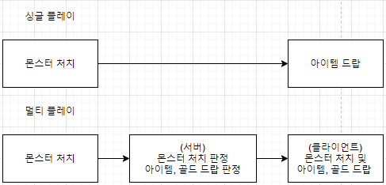

# 네트워크와 게임 로직 분리

이 게임은 싱글플레이와 멀티플레이를 지원하지만 이 때문에 모든 게임 파트에서 싱글플레이와 멀티플레이를 구분하여 구현하는 것은 매우 비효율적입니다 

클라이언트 작업 특성 상 싱글플레이로 보고 제작하는 것이 매우 효율적이므로 네트워크 관련 파트를 제외한 모든 파트에서는 싱글플레이로 보고 제작합니다   
다만 이 게임은 멀티플레이도 가능해야하므로 싱글플레이와 멀티플레이가 다른 몇 가지 부분은 구조 상 타협이 필요합니다

